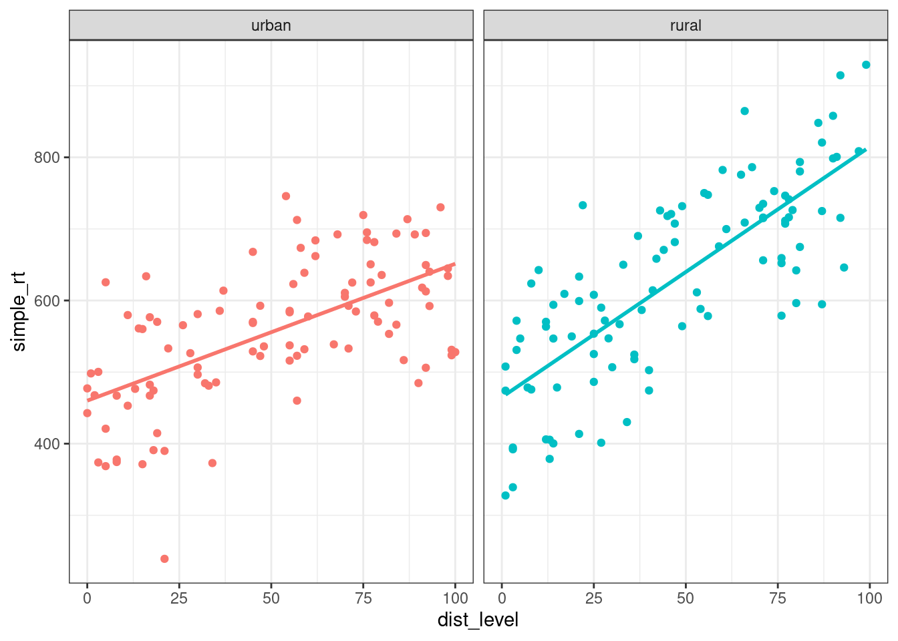
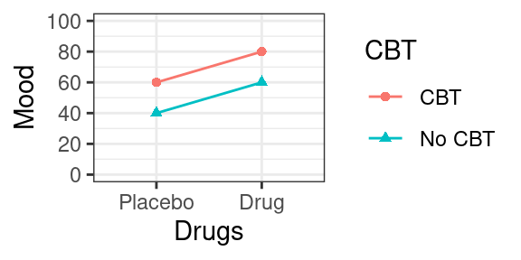
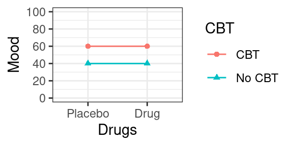
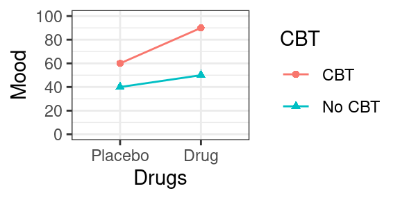

# Interactions


## Learning objectives

* model and interpret continuous-by-categorical interactions
* model and interpret categorical-by-categorical interactions in factorial designs
* estimate and test effects in factorial designs using ANOVA or regression

<!-- understand a common fallacy regarding interactions -->


## Interactions

Up to now, we've been focusing on estimating and interpreting the effect of a variable or linear combination of predictor variables on a response variable. However, there are often situations where the effect of one predictor on the response depends on the value of another predictor variable. We can actually estimate and interpret this dependency as well, by including an **interaction** term in our model.

## Continuous-by-Categorical Interactions {#cont-by-cat}

One common example of this is when you are interested in whether a linear relationship between a continous predictor and a continuous response is different for two groups. 

Let's consider a simple fictional example. Say you are interested in the effects of sonic distraction on cognitive performance. Each participant in your study is randomly assigned to receive a particular amount of sonic distraction while they perform a simple reaction time task (respond as quickly as possible to a flashing light). You have a technique that allows you to automatically generate different levels of background noise (e.g., frequency and amplitude of city sounds, such as sirens, jackhammers, people yelling, glass breaking, etc.). Each participant performs the task for a randomly chosen level of distraction (0 to 100). Your hypothesis is that urban living makes people's task performance more immune to sonic distraction. You want to compare the relationship between distraction and performance for city dwellers to the relationship for people from quieter rural environments.

You have three variables:

* A continuous response variable, `mean_RT`, with higher levels reflecting slower RTs;
* A continuous predictor variable, level of sonic distraction (`dist_level`), with higher levels indicating more distraction;
* A factor with two levels, `group` (urban vs. rural).

Let's start by simulating some data for the urban group. Let's assume that with zero distraction (silence), the average RT is about 450 milliseconds, and that with each unit increase on the distraction scale, RT increases about 2 ms.  This gives us the following linear model:

$$Y_i = 450 + 2 X_i + e_i$$

where $X_i$ is the amount of sonic distraction.

Let's simulate data for 100 participants as below with $\sigma = 80$, setting the seed before we begin.


```r
library("tidyverse")
set.seed(1031)

n_subj <- 100L  # simulate data for 100 subjects
b0_urban <- 450 # y-intercept
b1_urban <- 2   # slope

# decomposition table
urban <- tibble(
  subj_id = 1:n_subj,
  group = "urban",
  b0 = 450,
  b1 = 2,
  dist_level = sample(0:n_subj, n_subj, replace = TRUE),
  err = rnorm(n_subj, mean = 0, sd = 80),
  simple_rt = b0 + b1 * dist_level + err)

urban
```

```
## # A tibble: 100 x 7
##    subj_id group    b0    b1 dist_level     err simple_rt
##      <int> <chr> <dbl> <dbl>      <int>   <dbl>     <dbl>
##  1       1 urban   450     2         59  -36.1       532.
##  2       2 urban   450     2         45  128.        668.
##  3       3 urban   450     2         55   23.5       584.
##  4       4 urban   450     2          8    1.04      467.
##  5       5 urban   450     2         47   48.7       593.
##  6       6 urban   450     2         96   88.2       730.
##  7       7 urban   450     2         62  110.        684.
##  8       8 urban   450     2          8  -91.6       374.
##  9       9 urban   450     2         15 -109.        371.
## 10      10 urban   450     2         70   20.7       611.
## # … with 90 more rows
```

Let's plot the data we created, along with the line of best fit.


```r
ggplot(urban, aes(dist_level, simple_rt)) + 
  geom_point(alpha = .2) +
  geom_smooth(method = "lm", se = FALSE)
```

```
## `geom_smooth()` using formula 'y ~ x'
```

<div class="figure" style="text-align: center">

<p class="caption">(\#fig:plot-urban)*Effect of sonic distraction on simple RT, urban group.*</p>
</div>

Now let's simulate data for the urban group. We assume that these participants should perhaps have a little higher intercept, maybe because they are less familiar with technology. Most importantly, we assume that they would have a steeper slope because they are more affected by the noise. Something like:

$$Y_i = 500 + 3 X_i + e_i$$


```r
b0_rural <- 500
b1_rural <- 3

rural <- tibble(
  subj_id = 1:n_subj + n_subj,
  group = "rural",
  b0 = b0_rural,
  b1 = b1_rural,
  dist_level = sample(0:n_subj, n_subj, replace = TRUE),
  err = rnorm(n_subj, mean = 0, sd = 80),
  simple_rt = b0 + b1 * dist_level + err)
```

Now let's plot the data from the two groups side by side.


```r
all_data <- bind_rows(urban, rural)

ggplot(all_data %>% mutate(group = fct_relevel(group, "urban")), 
       aes(dist_level, simple_rt, colour = group)) +
  geom_point() +
  geom_smooth(method = "lm", se = FALSE) +
  facet_wrap(~ group) + 
  theme(legend.position = "none")
```

```
## `geom_smooth()` using formula 'y ~ x'
```

<div class="figure" style="text-align: center">

<p class="caption">(\#fig:combined-plot)*Effect of sonic distraction on simple RT for urban and rural participants.*</p>
</div>

Here we see very clearly the difference in slope that we built into our data. How do we test whether the two slopes are significantly different?  To do this, we can't have two separate regressions. We need to bring the two regression lines into the same model. How do we do this?

Note that we can represent one of the regression lines in terms of 'offset' values from the other. We (arbitrarily) choose one group as our 'baseline' group, and represent the y-intercept and slope of the other group as offsets from this baseline. So if we choose the urban group as our baseline, we can express the y-intercept and slope for the rural group in terms of two offsets, $\beta_2$ and $\beta_3$, for the y-intercept and slope, respectively.

* y-intercept: $\beta_{0\_rural} = \beta_{0\_urban} + \beta_2$
* slope: $\beta_{1\_rural} = \beta_{1\_urban} + \beta_3$

Our urban group had parameters $\beta_{0\_urban} = 450$ (`b0_urban <- 450`) and $\beta_{1\_urban} = 2$ (`b1_urban <- 2`), whereas the rural broup had $\beta_{0\_rural} = 500$ (`b0_rural <- 500`) and $\beta_{1\_rural} = 3$ (`b1_rural <- 3`). It directly follows that $\beta_2 = 50$ and $\beta_3 = 1$ for our simulated example.

So our two regression models are now:

$$Y_{i\_urban} = \beta_{0\_urban} + \beta_{1\_urban} X_i + e_i$$

and 

$$Y_{i\_rural} = (\beta_{0\_urban} + \beta_2) + (\beta_{1\_urban} + \beta_3) X_i + e_i.$$

OK, we feel like we're closer to getting these into a single regression model. Here's the final trick. We define an additional dummy predictor variable that takes on the value 0 for the urban group (which we chose as our 'baseline' group) and 1 for the other group. Our final model takes the following form.

<div class="try">

**Regression model with a continuous-by-categorical interaction.**

$$Y_{i} = \beta_0 + \beta_1 X_{1i} + \beta_2 X_{2i} + \beta_3 X_{1i} X_{2i} + e_{i}$$

where 

* $X_{1i}$ is the continous predictor, and
* $X_{2i}$ is a dummy-coded variable taking on 0 for the baseline, 1 for the alternative group.

Interpretation of parameters:

* $\beta_0$: y-intercept for the baseline group;
* $\beta_1$: slope for the baseline group;
* $\beta_2$: offset to y-intercept for the alternative group;
* $\beta_3$: offset to slope for the alternative group.

Estimation in R:

`lm(Y ~ X1 + X2 + X1:X2, data)` or, as a shortcut:

`lm(Y ~ X1 * X2)` where `*` means "all possible main effects and interactions of X1 and X2"

</div>

The term associated with $\beta_3$ is an **interaction term**, where the predictor is the product of predictor values.  Let's now show that the above GLM gives us the two regression lines that we want.  Plugging in 0 for $X_{2i}$ and reducing gives us

$$Y_{i} = \beta_0 + \beta_1 X_{1i} + \beta_2 0 + \beta_3 X_{1i} 0 + e_i$$

which is just

$$Y_{i} = \beta_0 + \beta_1 X_{1i} + e_i,$$

the regression equation for our baseline (urban) group. Compare this to $Y_{i\_urban}$ above.

Plugging in 1 for $X_{2i}$ should give us the equation for our rural group. We get

$$Y_{i} = \beta_0 + \beta_1 X_{1i} + \beta_2 1 + \beta_3 X_{1i} 1 + e_i$$

which, after reducing and applying a little algebra, can also be expressed as

$$Y_{i} = \beta_0 + \beta_2 + (\beta_1 + \beta_3) X_{1i} + e_i.$$

Compare this to $Y_{i\_rural}$ above. The dummy-coding trick works!

Now let's see how to estimate the regression in R.  Let's say we wanted to test the hypothesis that the slopes for the two lines are different. Note that this just amounts to testing the null hypothesis that $\beta_3 = 0$, because $\beta_3$ is our slope offset.

We have already created the dataset `all_data` combining the simulated data for our two groups. The way we express our model using R formula syntax is `Y ~ X1 + X2 + X1:X2` where `X1:X2` tells R to create a predictor that is the product of predictors X1 and X2. There is a shortcut `Y ~ X1 * X2` which tells R to calculate all possible main effects and interactions.  First we'll add a dummy predictor to our model, storing the result in `all_data2`.


```r
all_data2 <- all_data %>%
  mutate(grp = if_else(group == "rural", 1, 0))
```


```r
sonic_mod <- lm(simple_rt ~ dist_level + grp + dist_level:grp, all_data2)

summary(sonic_mod)
```

```
## 
## Call:
## lm(formula = simple_rt ~ dist_level + grp + dist_level:grp, data = all_data2)
## 
## Residuals:
##      Min       1Q   Median       3Q      Max 
## -261.130  -50.749    3.617   62.304  191.211 
## 
## Coefficients:
##                Estimate Std. Error t value Pr(>|t|)    
## (Intercept)    460.1098    15.5053  29.674  < 2e-16 ***
## dist_level       1.9123     0.2620   7.299 7.07e-12 ***
## grp              4.8250    21.7184   0.222    0.824    
## dist_level:grp   1.5865     0.3809   4.166 4.65e-05 ***
## ---
## Signif. codes:  0 '***' 0.001 '**' 0.01 '*' 0.05 '.' 0.1 ' ' 1
## 
## Residual standard error: 81.14 on 196 degrees of freedom
## Multiple R-squared:  0.5625,	Adjusted R-squared:  0.5558 
## F-statistic: 83.99 on 3 and 196 DF,  p-value: < 2.2e-16
```

Can you identify the values of the regression coefficients in the output?

## Categorical-by-Categorical Interactions

**Factorial designs** are very common in psychology, and are most often analyzed using ANOVA-based techniques, which can obscure that they are also just models.

A factorial design is one in which the predictors (IVs) are all categorical: each is a **factor** having a fixed number of **levels**.  In a full-factorial design, the factors are fully crossed with each other such that each possible combination of factors is represented.  We call each unique combination a **cell** of the design. You will often hear designs referred to as "a two-by-two design" (2x2), which means that there are two factors, each of which has three levels. A "three-by-three" (3x3) design is one where there are two factors, each with three levels; a "two-by-two-by-two" 2x2x2 design is one in which there are three factors, each with two levels; and so on.

Typically, factorial designs are given a tabular representation, showing all the combinations of factor levels. Below is a tabular representation of a 2x2 design.

<table class="table" style="width: auto !important; margin-left: auto; margin-right: auto;">
 <thead>
  <tr>
   <th style="text-align:left;">   </th>
   <th style="text-align:left;"> $B_1$ </th>
   <th style="text-align:left;"> $B_2$ </th>
  </tr>
 </thead>
<tbody>
  <tr>
   <td style="text-align:left;"> $A_1$ </td>
   <td style="text-align:left;"> $AB_{11}$ </td>
   <td style="text-align:left;"> $AB_{12}$ </td>
  </tr>
  <tr>
   <td style="text-align:left;"> $A_2$ </td>
   <td style="text-align:left;"> $AB_{21}$ </td>
   <td style="text-align:left;"> $AB_{22}$ </td>
  </tr>
</tbody>
</table>

A 3x2 design might be shown as follows.

<table class="table" style="width: auto !important; margin-left: auto; margin-right: auto;">
 <thead>
  <tr>
   <th style="text-align:left;">   </th>
   <th style="text-align:left;"> $B_1$ </th>
   <th style="text-align:left;"> $B_2$ </th>
  </tr>
 </thead>
<tbody>
  <tr>
   <td style="text-align:left;"> $A_1$ </td>
   <td style="text-align:left;"> $AB_{11}$ </td>
   <td style="text-align:left;"> $AB_{12}$ </td>
  </tr>
  <tr>
   <td style="text-align:left;"> $A_2$ </td>
   <td style="text-align:left;"> $AB_{21}$ </td>
   <td style="text-align:left;"> $AB_{22}$ </td>
  </tr>
  <tr>
   <td style="text-align:left;"> $A_3$ </td>
   <td style="text-align:left;"> $AB_{31}$ </td>
   <td style="text-align:left;"> $AB_{32}$ </td>
  </tr>
</tbody>
</table>

And finally, here's a 2x2x2 design.

$$C_1$$

<table class="table" style="width: auto !important; margin-left: auto; margin-right: auto;">
 <thead>
  <tr>
   <th style="text-align:left;">   </th>
   <th style="text-align:left;"> $B_1$ </th>
   <th style="text-align:left;"> $B_2$ </th>
  </tr>
 </thead>
<tbody>
  <tr>
   <td style="text-align:left;"> $A_1$ </td>
   <td style="text-align:left;"> $ABC_{111}$ </td>
   <td style="text-align:left;"> $ABC_{121}$ </td>
  </tr>
  <tr>
   <td style="text-align:left;"> $A_2$ </td>
   <td style="text-align:left;"> $ABC_{211}$ </td>
   <td style="text-align:left;"> $ABC_{221}$ </td>
  </tr>
</tbody>
</table>

$$C_2$$

<table class="table" style="width: auto !important; margin-left: auto; margin-right: auto;">
 <thead>
  <tr>
   <th style="text-align:left;">   </th>
   <th style="text-align:left;"> $B_1$ </th>
   <th style="text-align:left;"> $B_2$ </th>
  </tr>
 </thead>
<tbody>
  <tr>
   <td style="text-align:left;"> $A_1$ </td>
   <td style="text-align:left;"> $ABC_{112}$ </td>
   <td style="text-align:left;"> $ABC_{122}$ </td>
  </tr>
  <tr>
   <td style="text-align:left;"> $A_2$ </td>
   <td style="text-align:left;"> $ABC_{212}$ </td>
   <td style="text-align:left;"> $ABC_{222}$ </td>
  </tr>
</tbody>
</table>

<div class="warning">

Don't confuse **factors** and **levels**!

If you hear about a study that has three treatment groups (treatment A, treatment B, and control), that is not a "three-factor (three-way) design". That is a one-factor (one-way) design with a single three-level factor (treatment condition).

There is no such thing as a factor that has only one level.

</div>

You can find out how many cells a design has by multiplying the number of levels of each factor. So, a 2x3x4 design would have 24 cells in the design.

### Effects of cognitive therapy and drug therapy on mood

Let's consider a simple factorial design and think about the types of patterns our data can show. After we get the concepts down from this concrete example, we'll map them onto the more abstract statistical terminology.

Imagine you've running a study looking at effects of two different types of therapy for depressed patients, cognitive therapy and drug therapy. Half of the participants are randomly assigned to receive Cognitive Behavioral Therapy (CBT) and the other half get some other kind of control activity. Also, you further divide your patients through random assignment into a drug therapy group, whose members receive anti-depressants, and an control group, whose members receive a placebo.  After treatment (or control/placebo), you measure their mood on a scale, with higher numbers corresponding to a more positive mood.

Let's imagine that the means we obtain below are the population means, free of measurement or sampling error.  We'll take a moment to consider three different possible outcomes and what they imply about how these therapies might work independently or interactively to affect mood.

<div class="warning">

Keep in mind that you will almost **never** know the true means of any population that you care about, unless you have measured all members of the population, and done so without measurement error. Below, we're talking about the hypothetical situation where you actually know the population means and can draw conclusions without any statistical tests. Any real sample means you look at will include sampling and measurement error, and any inferences you'd make would depend on the outcome of statistical tests, rather than the observed pattern of means.

</div>

#### Scenario A {-}

<div class="figure" style="text-align: center">

<p class="caption">(\#fig:scenario-a-plot)*Scenario A, plot of cell means.*</p>
</div>

Below is a table of **cell means** and **marginal means**.  The cell means are the mean values of the dependent variable (mood) at each cell of the design. The marginal means (in the margins of the table) provide the means for each row and column.

<table class="table" style="width: auto !important; margin-left: auto; margin-right: auto;">
<caption>(\#tab:scenario-a-means)*Scenario A, Table of Means.*</caption>
 <thead>
  <tr>
   <th style="text-align:left;">   </th>
   <th style="text-align:right;"> No CBT </th>
   <th style="text-align:right;"> CBT </th>
   <th style="text-align:left;">    </th>
  </tr>
 </thead>
<tbody>
  <tr>
   <td style="text-align:left;"> Placebo </td>
   <td style="text-align:right;"> 40 </td>
   <td style="text-align:right;"> 60 </td>
   <td style="text-align:left;"> 50 </td>
  </tr>
  <tr>
   <td style="text-align:left;"> Drug </td>
   <td style="text-align:right;"> 60 </td>
   <td style="text-align:right;"> 80 </td>
   <td style="text-align:left;"> 70 </td>
  </tr>
  <tr>
   <td style="text-align:left;">  </td>
   <td style="text-align:right;"> 50 </td>
   <td style="text-align:right;"> 70 </td>
   <td style="text-align:left;">  </td>
  </tr>
</tbody>
</table>

If this was our outcome, what would you conclude? Is cognitive therapy having an effect on mood? How about drug therapy. The answer to both of these questions is yes: The mean mood for people who got CBT (70; mean of column 2) is 20 points higher than the mean mood for people who didn't (50; mean of column 1).

Likewise, people who got anti-depressants showed enhanced mood (70; mean of row 2) relative to people who got the placebo (50; mean of row 1).

Now we can also ask the following question: **did the effect of cognitive therapy depend on whether or not the patient was simultaneously receiving drug therapy**? The answer to this, is no. To see why, note that for the Placebo group (Row 1), cognitive therapy increased mood by 20 points (from 40 to 60). But this was the same for the Drug group: there was an increase of 20 points from 60 to 80. So, no evidence that the effect of one factor on mood depends on the other.

#### Scenario B {-}

<div class="figure" style="text-align: center">

<p class="caption">(\#fig:scenario-b-plot)*Scenario B, plot of cell means.*</p>
</div>

<table class="table" style="width: auto !important; margin-left: auto; margin-right: auto;">
<caption>(\#tab:scenario-b-means)*Scenario B, Table of Means.*</caption>
 <thead>
  <tr>
   <th style="text-align:left;">   </th>
   <th style="text-align:right;"> No CBT </th>
   <th style="text-align:right;"> CBT </th>
   <th style="text-align:left;">    </th>
  </tr>
 </thead>
<tbody>
  <tr>
   <td style="text-align:left;"> Placebo </td>
   <td style="text-align:right;"> 40 </td>
   <td style="text-align:right;"> 60 </td>
   <td style="text-align:left;"> 50 </td>
  </tr>
  <tr>
   <td style="text-align:left;"> Drug </td>
   <td style="text-align:right;"> 40 </td>
   <td style="text-align:right;"> 60 </td>
   <td style="text-align:left;"> 50 </td>
  </tr>
  <tr>
   <td style="text-align:left;">  </td>
   <td style="text-align:right;"> 40 </td>
   <td style="text-align:right;"> 60 </td>
   <td style="text-align:left;">  </td>
  </tr>
</tbody>
</table>

In this scenario, we also see that CBT improved mood (again, by 20 points), but there was no effect of Drug Therapy (equal marginal means of 50 for row 1 and row 2). We can also see here that the effect of CBT also didn't depend upon Drug therapy; there is an increase of 20 points in each row.

#### Scenario C {-}

<div class="figure" style="text-align: center">

<p class="caption">(\#fig:scenario-c-plot)*Scenario C, plot of cell means.*</p>
</div>

<table class="table" style="width: auto !important; margin-left: auto; margin-right: auto;">
<caption>(\#tab:scenario-c-means)*Scenario C, Table of Means.*</caption>
 <thead>
  <tr>
   <th style="text-align:left;">   </th>
   <th style="text-align:right;"> No CBT </th>
   <th style="text-align:right;"> CBT </th>
   <th style="text-align:left;">    </th>
  </tr>
 </thead>
<tbody>
  <tr>
   <td style="text-align:left;"> Placebo </td>
   <td style="text-align:right;"> 40 </td>
   <td style="text-align:right;"> 60 </td>
   <td style="text-align:left;"> 50 </td>
  </tr>
  <tr>
   <td style="text-align:left;"> Drug </td>
   <td style="text-align:right;"> 50 </td>
   <td style="text-align:right;"> 90 </td>
   <td style="text-align:left;"> 70 </td>
  </tr>
  <tr>
   <td style="text-align:left;">  </td>
   <td style="text-align:right;"> 45 </td>
   <td style="text-align:right;"> 75 </td>
   <td style="text-align:left;">  </td>
  </tr>
</tbody>
</table>

Following the logic in previous sections, we see that overall, people who got cognitive therapy showed elevated mood relative to control (75 vs 45), and that people who got drug therapy also showed elevated mood relative to placebo (70 vs 50). But there is something else going on here: it seems that the effect of cognitive therapy on mood was **more pronounced for patients who were also receiving drug therapy**. For patients on antidepressants, there was a 40 point increase in mood relative to control (from 50 to 90; row 2 of the table). For patients who got the placebo, there was only a 20 point increase in mood, from 40 to 60 (row 1 of the table). So in this hypothetical scenario, **the effect of cognitive therapy depends on whether or not there is also ongoing drug therapy.**

### Effects in a factorial design

If you understand the basic patterns of effects described in the previous section, you are then ready to map these concepts onto statistical language.

#### Main effect

**Main effect**: The effect of a factor on the DV **ignoring** the other factors in the design. 

The test of a main effect is a test of the equivalence of marginal means. So in Scenario A above, when you compared the row means for drug therapy, you were assessing the main effect of this factor on mood. The null hypothesis would be that the two marginal means are equal:

$$\bar{Y}_{1..} = \bar{Y}_{2..}$$

where $Y_{i..}$ is the mean of row $i$, ignoring the column factor.

If you have a factor with $k$ levels where $k > 2$, the null hypothesis for the main effect is 

$$\bar{Y}_{1..} = \bar{Y}_{2..} = \ldots = \bar{Y}_{k..},$$

i.e., that all of the row (or column) means are equal.

#### Simple effect

A **Simple effect** is the effect of one factor at a specific level of another factor (i.e., holding that factor constant at a particular value).

So for instance, in Scenario C, we talked about the effect of CBT for participants in the anti-depressant group. In that case, the simple effect of CBT for participants receiving anti-depressants was 40 units.

We could also talk about the simple effect of drug therapy for patients who received cognitive therapy. In Scenario C, this was an increase in mood from 60 to 90 (column 2).

#### Interaction

We say that an **interaction** is present when the effect of one variable differs across the levels of another variable.

A more mathematical definition is that an interaction is present when the simple effects of one factor differ across the levels of another factor. We saw this in Scenario C, with a 40 point boost of CBT for the anti-depressant group, compared to a boost of 20 for the placebo group. Perhaps the elevated mood caused by the anti-depressants made patients more susceptable to CBT.

The main point here is that we say there is a simple interaction between A and B when the simple effects of A differ across the levels of B. You could also check whether the simple effects of B differ across A. It is not possible for one of these statements to be true without the other also being true, so it doesn't matter which way you look at the simple effects.

### Higher-order designs

Two-factor (also known as "two-way") designs are very common in psychology and neuroscience, but sometimes you will also see designs with more than two factors, such as a 2x2x2 design. 

To figure out the number of effects we have of different kinds, we use the formula below, which gives us the number of possible combinations for $n$ elements take $k$ at a time:

$$\frac{n!}{k!(n - k)!}$$

Rather than actually computing this by hand, we can just use the `choose(n, k)` function in R.

For any design with $n$ factors, you will have:

* $n$ main effects;
* $\frac{n!}{2!(n - 2)!}$ two-way interactions;
* $\frac{n!}{3!(n - 3)!}$ three-way interactions;
* $\frac{n!}{4!(n - 4)!}$ four-way interactions... and so forth.

So if we have a three-way design, e.g., a 2x2x2 with factors $A$, $B$, and $C$, we would have 3 main effects: $A$, $B$, and $C$. We would have `choose(3, 2)` = three two way interactions: $AB$, $AC$, and $BC$, and `choose(3, 3)` = one three-way interaction: $ABC$.

Three-way interactions are hard to interpret, but what they imply is that the **simple interaction** between any two given factors varies across the level of the third factor. For example, it would imply that the $AB$ interaction at $C_1$ would be different from the $AB$ interaction at $C_2$.

If you have a four way design, you have four main effects, `choose(4, 2) = `6 two-way interactions, `choose(4, 3) = `4 three-way interactions, and one four-way interaction. It is next to impossible to interpret results from a four-way design, so keep your designs simple!

<!-- ## A common fallacy
Comparing the significance of the simple effects is **not the same** as testing whether the simple effects are significantly different.
-->

## The GLM for a factorial design

Now let's look at the math behind these models. The typically way you'll see the GLM for an ANOVA written for a 2x2 factorial design uses "ANOVA" notation, like so:

$$Y_{ijk} = \mu + A_i + B_j + AB_{ij} + S(AB)_{ijk}.$$

In the above formula,

* $Y_{ijk}$ is the score for observation $k$ at level $i$ of $A$ and level $j$ of $B$;
* $\mu$ is the grand mean;
* $A_i$ is the main effect of factor $A$ at level $i$ of $A$;
* $B_j$ is the main effect of factor $B$ at level $j$ of $B$;
* $AB_{ij}$ is the $AB$ interaction at level $i$ of $A$ and level $j$ of $B$;
* $S(AB)_{ijk}$ is the residual.

An important mathematical fact is that the individual main and interaction effects sum to zero, often written as:

* $\Sigma_i A_i = 0$; 
* $\Sigma_j B_j = 0$;
* $\Sigma_{ij} AB_{ij} = 0$.

The best way to understand these effects is to see them in a decomposition table. Study the decomposition table belo wfor 12 simulated observations from a 2x2 design with factors $A$ and $B$. The indexes $i$, $j$, and $k$ are provided just to help you keep track of what observation you are dealing with. Remember that $i$ indexes the level of factor $A$, $j$ indexes the level of factor $B$, and $k$ indexes the observation number within the cell $AB_{ij}$.


```
## # A tibble: 12 x 9
##        Y     i     j     k    mu   A_i   B_j AB_ij   err
##    <dbl> <int> <int> <int> <dbl> <dbl> <dbl> <dbl> <int>
##  1    11     1     1     1    10     4    -2    -1     0
##  2    14     1     1     2    10     4    -2    -1     3
##  3     8     1     1     3    10     4    -2    -1    -3
##  4    17     1     2     1    10     4     2     1     0
##  5    15     1     2     2    10     4     2     1    -2
##  6    19     1     2     3    10     4     2     1     2
##  7     8     2     1     1    10    -4    -2     1     3
##  8     4     2     1     2    10    -4    -2     1    -1
##  9     3     2     1     3    10    -4    -2     1    -2
## 10    10     2     2     1    10    -4     2    -1     3
## 11     7     2     2     2    10    -4     2    -1     0
## 12     4     2     2     3    10    -4     2    -1    -3
```


### Estimation equations

These are the equations you would used to estimate effects in an ANOVA.

* $\hat{\mu} = Y_{...}$ 
* $\hat{A}_i = Y_{i..} - \hat{\mu}$ 
* $\hat{B}_j = Y_{.j.} - \hat{\mu}$ 
* $\widehat{AB}_{ij} = Y_{ij.} - \hat{\mu} - \hat{A}_i - \hat{B}_j$ 

Note that the $Y$ variable with the dots in the subscripts are means of $Y$, taken while ignoring anything appearing as a dot. So $Y_{...}$ is mean of $Y$, $Y_{i..}$ is the mean of $Y$ at level $i$ of $A$, $Y_{.j.}$ is the mean of $Y$ at level $j$ of $B$, and $Y_{ij.}$ is the mean of $Y$ at level $i$ of $A$ and level $j$ of $B$, i.e., the cell mean $ij$.

## Factorial App


[Launch this web application](http://shiny.psy.gla.ac.uk/Dale/factorial2){target="_blank"} and experiment with factorial designs until you understand the key concepts of main effects and interactions in a factorial design.
